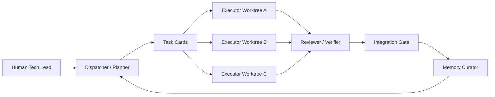

# Production AI Team Workflow

This directory implements a production-oriented AI development team:



## Core Idea

Parallelism happens only in isolated Git worktrees with explicit task boundaries. Quality control stays centralized through review and integration gates.

This avoids the common failure mode of many AI windows: each window has partial context, edits overlapping files, repeats past mistakes, and spends tokens rediscovering the project.

## Daily Workflow

1. Create a task card from `.ai-team/tasks/TEMPLATE.md`.
2. Ask the Dispatcher prompt in `.ai-team/prompts/dispatcher.md` to split the work and define file boundaries.
3. For each parallel-safe task, create a worktree with `.ai-team/scripts/New-AiTeamWorktree.ps1`.
4. Give each Executor only its task card, relevant files, and the memory summary from `.ai-team/scripts/Get-AiTeamContext.ps1`.
5. Run the Reviewer/Verifier prompt in `.ai-team/prompts/reviewer-verifier.md`.
6. Pass `.ai-team/checklists/review-gate.md` and `.ai-team/checklists/integration-gate.md` before merging.
7. Use `.ai-team/prompts/memory-curator.md` to update memory with only durable lessons.

## Minimal Commands

Most days in Codex, start here:

```text
我要做一个待办产品，MVP 包含登录、任务列表、部署到 Vercel
```

Say that directly in chat. Codex should route the request through `AGENTS.md` and `.ai-team/`.

See `.ai-team/CODEX.md` for the Codex-first workflow. The scripts are fallback helpers, not the normal user interface.

Create a task card:

```powershell
powershell -NoProfile -ExecutionPolicy Bypass -File .ai-team/scripts/New-AiTeamTask.ps1 -Id login-auth -Title "Implement login auth"
```

Print an agent startup bundle:

```powershell
powershell -NoProfile -ExecutionPolicy Bypass -File .ai-team/scripts/Get-AiTeamContext.ps1 -TaskId login-auth
```

Create an isolated worktree:

```powershell
powershell -NoProfile -ExecutionPolicy Bypass -File .ai-team/scripts/New-AiTeamWorktree.ps1 -TaskId login-auth
```

Review a task diff:

```powershell
powershell -NoProfile -ExecutionPolicy Bypass -File .ai-team/scripts/Test-AiTeamTask.ps1 -TaskId login-auth -WorktreePath <path-to-worktree>
```

Generate a ready-to-paste role startup prompt:

```powershell
powershell -NoProfile -ExecutionPolicy Bypass -File .ai-team/scripts/Start-AiTeamRole.ps1 -Role dispatcher -TaskId login-auth
```

Install local hook examples for tools that support command hooks:

```powershell
powershell -NoProfile -ExecutionPolicy Bypass -File .ai-team/scripts/Install-AiTeamHooks.ps1
```

Use the universal hook command directly:

```powershell
powershell -NoProfile -ExecutionPolicy Bypass -File .ai-team/hooks/ai-team-hook.ps1 -Role executor -TaskId login-auth
```

## Non-Negotiable Rules

- Default parallelism is 2 to 3 Executor agents. Use 4 only when file boundaries are very clean.
- A task that touches shared data models, common APIs, auth, payment, migrations, or build configuration is serial by default.
- No Executor approves its own work.
- No task is done without a reproducible verification command or an explicit reason why verification is impossible.
- Memory must be compressed and reusable. Full transcripts, raw logs, and one-off observations do not belong in memory.

## Directory Map

- `.ai-team/memory/`: durable project context, pitfalls, and reusable patterns.
- `.ai-team/tasks/`: task cards and task state.
- `.ai-team/prompts/`: role prompts for Dispatcher, Executor, Reviewer, and Memory Curator.
- `.ai-team/checklists/`: plan, review, and integration gates.
- `.ai-team/scripts/`: small PowerShell helpers for repeatable operations.
- `.ai-team/hooks/`: reusable hook entrypoints and examples for agent tools.
